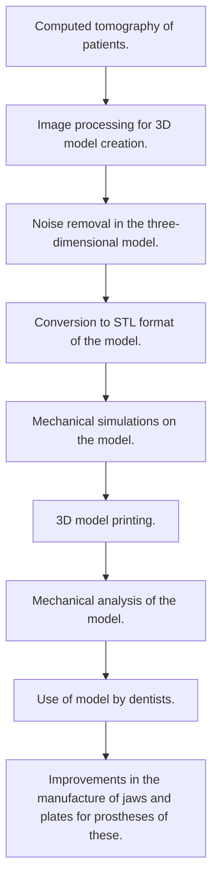

<!--more-->

# Some of My Favorite Projects

## Milk bottles line.

### Situation Diagram

It seeks to carry out the process of a production line for a system that can perform the following tasks:
- Filling
- Placement of covers
- Palletizing
 
The system is an automated line with a conveyor belt that moves a set of 3 bottles, towards the different stages of the process, when these bottles arrive at any station of the process, they are detected by a sensor, which carries out the count of The bottles.
The first "Filling" station must allow the entry of 3 bottles so that they can be filled.
This process consists of 3 actuators:  
- 1A double-acting cylinder to lower the filling unit.
- 2A single-acting cylinder to unblock the passage of the material with which the bottles will be filled. This unlock should last 4 seconds, so a timer should be used here.
- 3A single-acting cylinder to block the passage to the next station. Here, another timer must be used to simulate the time it would take for the bottles to move to the next station.  
For simulation purposes, a time of 2 seconds will be used.
The second station "Cap placement" must receive 3 bottles, allow their entry, detect and count them. Once inside they must be screwed.
This process consists of 5 actuators:
- The actuator 4A is a double-acting cylinder that lowers to be able to position itself on the bottle to start the placement of the screw caps.
- The 5A actuator is a single-acting cylinder which is initially extended, when activated, it retracts and allows the screw caps to pass towards the top of the bottle.
- The 6A actuator is a pneumatic gripper, in this case it operates as a single-acting cylinder. When activated, it must hold the cover to allow it to be turned with force.
- The 7A actuator is a rotic, this rotic when holding the cap and turning, closes the bottle, and in this way the cap remains on.
- Actuator 8A is a single-acting cylinder, it allows the bottles to pass to the next station and after a while it closes blocking, this simulating the time it would take for the bottles to pass through the band to reach the next stage, to simulation effects will be used 2 seconds. 

The third "Palletizing" station must receive 3 bottles, allow their entry, count them and push them to a storage position such as a box. When completing 4 cycles, a pallet of 12 milk bottles is assembled, which sends a signal, to indicate that this was achieved.
This process consists of 2 actuators:
- Cylinder 9A is a single-acting cylinder that allows the bottles to pass to the station, this considers the transport through the belt, so physically it would take some time, for simulation we consider this time as 2 seconds.
- Cylinder 10A is a double-acting cylinder that moves the 3 bottles towards the accumulation zone. The advantage of using a double acting cylinder is that the force with which it returns can be physically controlled so that it could perform an additional task.
- Palletizing additionally has a pivot that when completing 4 cycles is activated, showing that it has been completed.
All actuators use magnetic sensors so that they do not interfere with the system when extending and retracting, except for the rotic actuator that uses cam sensors.

### Movement Diagram

### Pneumatic Diagram

### States Diagram

##Dividing the process

###Station 1 Milk Filling Pneumatic Diagram

###Station 2 Place Lids Pneumatic Diagram

###Station 3 Palletizing Pneumatic Diagram

### Operation Diagram for boxes of 12 bottles

## Pick & Place Programming with FactoryIO

This is a simulation of a workcell focusing on moving pieces from one conveyor band to another one. The project was done using FactoryIO's Function Block Diagram (FBD). The main purpose of this team project was managing multiple actuators and sensors at the same time resulting in a combinational system of Industrial Automation.



### Connections Diagram

### Actuators Diagram

### Movement Diagram

### FBD Inputs and Outputs from the scene

## Robot Operating System (ROS) MoveIt and CoppeliaSim interaction

This team project was an effort from a team of 4 in the development of a methodology for the implementation of ROS with existing lab equipment including the UR5e, and some of the work cells that were available on the Automation and Industrial Manufacturing Lab from Universidad Anahuac. Different simulations were performed with different parameters, sensors, and different data was transmitted. The framework allowed the connection of ROS with the physical Robot and a virtual twin. An extra effort was given in the complete documentation of the whole process for future reference by the lab administrators. Data could be sent and read from the robot using ROS allowing the creation of more complex work cells in the future.

### Robot Simulation TEST



### Robot Communication TEST with Camera



### Robot Communication with MoveIt 1



### Robot Communication with MoveIt 2



## Pick & Place XYZ

This is a simulation of a workcell focusing on stacking boxes on groups 3 in a pallet. One of the actuators used in the workcell is a pick & place actuator with 3 axis and a analog configuration, that's the challenge of this workcell. The project was done using FactoryIO's Function Block Diagram (FBD). The main purpose of this team project was managing multiple bands counters and sensors at the same time and the analog actuators in a combinational system of Industrial Automation.



### Connections Diagram

### Actuators Diagram

### Movement Diagram

### FBD Inputs and Outputs from the scene

## Mandible 3D scan and print

### Introduction
Through the use of a tomography, the aim is to create a three-dimensional model of a jaw, in order to help dentists to be able to perform dental surgeries before carrying them out on real patients, in addition to the creation and analysis of jaw prostheses. .

### Objective
• Printing of the 3D model of the jaw for practice and help in operating techniques.
• Improvements in prototyping material and application to prostheses.

### Methodology

### Results

### STL

## Assembler

This is a simulation of a workcell focusing on assembling a piece, made up of a lid and a base. The conveyor bands work in an asynchronous manner, so sensors must be used and programmed to determine the correct time the lid should be picked and placed on the base. A counter of the amount of items assembled is also part of the workcell. The amount of pieces can be limited just by changing a variable in the program, and the process can be stopped in case of an emergency. If no problem arises the process may continue indefinitely. This cell was programmed both with FactoryIO FBD and with the LOGO! FBD.



### Connections Diagram

### Actuators Diagram

### Movement Diagram

### FBD Inputs and Outputs from the scene

### FactoryIO FBD Code Example

STEP 1  

LIDS Conveyor  

Emergency Stop  

### LOGO! FBD Code Example

STEP 1  

LIDS Conveyor  

Emergency Stop  

## Full Robotics Flexible Workcell

In this project a team of 3 worked in programming a manual flexible workcell using the MRL programming language.
By receiving a different input a different output for the Robot was generated. Depending on the previous steps and state only some actions can be done.
Upon advancing the manufacturing of the work piece different flags are activated showing a led indicator. The idea of this project was allowing the usage of HMIs in conjunction with a robot.



## Crankshaft Study
It is desired to make a frequencies study of a crankshaft made of AISI 304 material and how different torsions and centrifugal forces affect the deformation of parts with their resonant frequencies.  

[More Projects Videos on Youtube](https://www.youtube.com/channel/UCiZ_cD1wZ4FmyN7xW8ATx2g)
[Other Projects](https://cesar514.github.io/blog/archive.html)
<!-- [More Automation Click Here](2016/05/16/memorama-the-game.html)   -->
<!-- [More Robots and workcells Click Here](2016/05/16/memorama-the-game.html)   -->
<!-- [More CAD Click Here](2016/05/16/memorama-the-game.html)   -->
