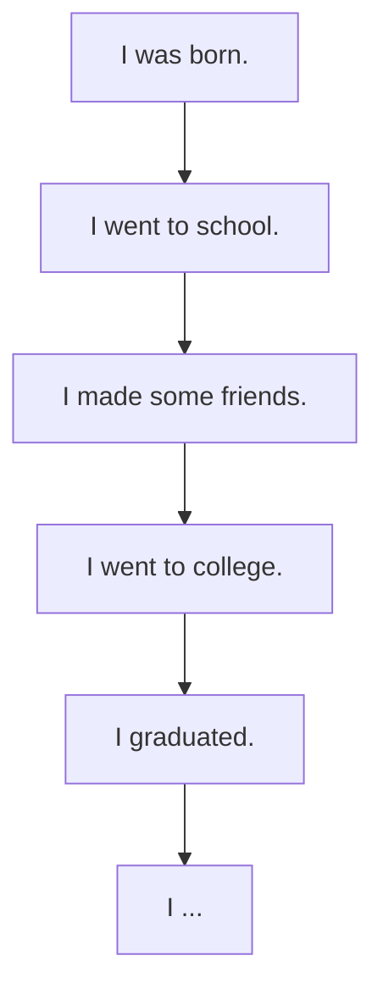
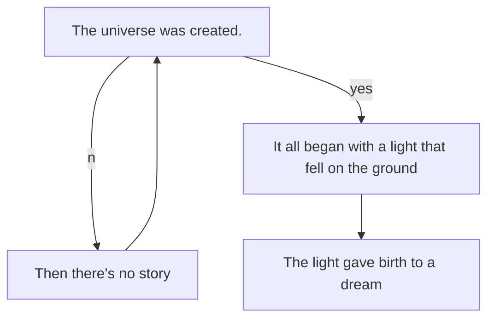
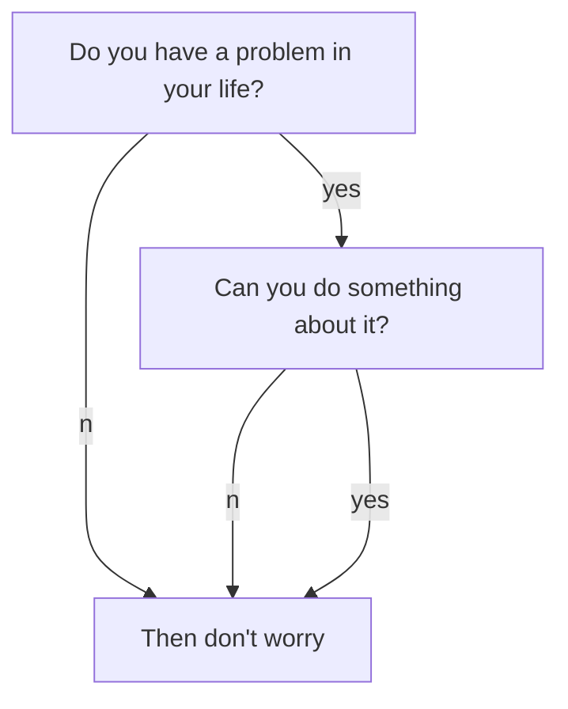

### Life Timeline

```mermaid
graph TB;
    A001[I was born.]
    A002[I went to school.]
    A003[I made some friends.]
    A004[I went to college.]
    A005[I graduated.]
    A006[I ...]
    A001-->A002;
    A002-->A003;
    A003-->A004;
    A004-->A005;
    A005-->A006;
```

### Dreams Timeline

```mermaid
graph TB;
    A001[The universe was created.]
    A002[It all began with a light that fell on the ground]
    A003[The light gave birth to a dream]
    B001[Then there's no story]
    A001--no-->B001;
    A001--yes-->A002;
    B001-->A001;
    A002-->A003
```

### Other Timelines

```mermaid
graph TB;
    Ab[Do you have a problem in your life?]
    B[Then don't worry]
    C[Can you do something about it?]
    Ab--no-->B;
    Ab--yes-->C;
    C--no-->B;
    C--yes-->B;
```

